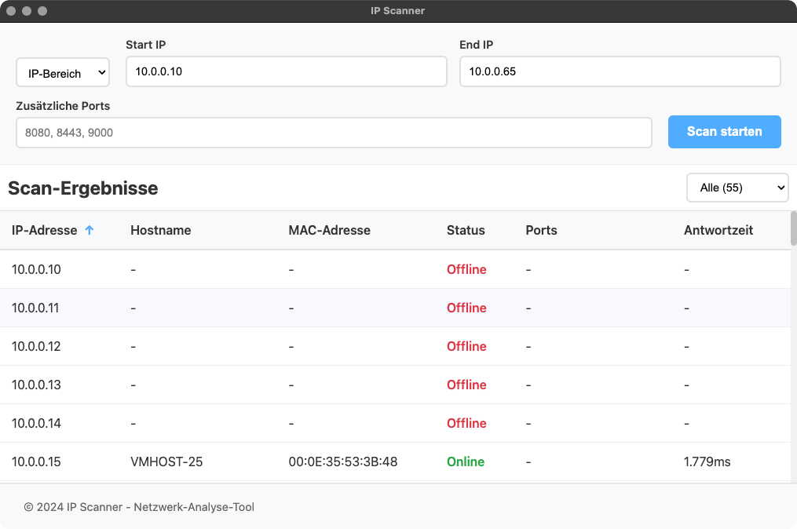
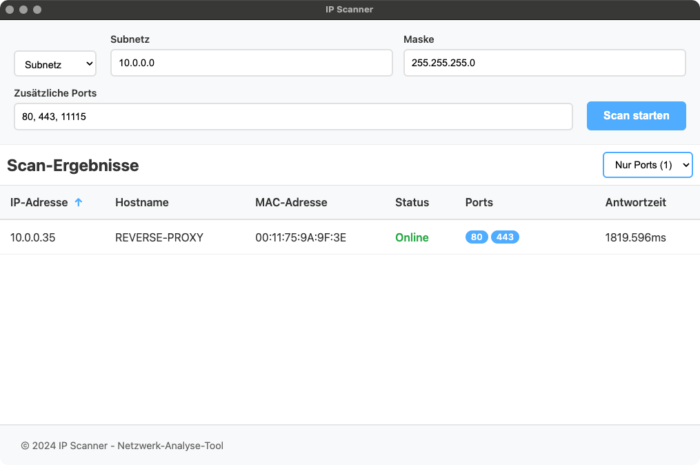

# IP Scanner

Schneller Netzwerkscanner inkl. Portscanner. Läuft dank Electron (theoretisch) auf Windows, macOS und Linux

</img> </img> 

## Features

- **IP-Bereich-Scanning**: Scannen von IP X bis IP Y (bspw. `192.168.120.10` bis `192.168.120.55`)
- **Subnetz-Scanning**: Allternativ: scannen ganzer Subnetze mit Subnetzmaske<br>(bspw. `192.168.120.0` mit `255.255.255.0`)
- **Port-Scanning**: Angabe einer kommagetrennten Liste mit TCP-Ports, die geprüft werden sollen
- **Schnelles Filtern in der App**: Anzeige von allen Hosts, Hosts mit mind. einem offenem Port, oder Hosts die generell online sind
- **Hostname und MAC**: damit man nicht mehr unter MacOS zwei verschiedene Scanner nutzen muss, um beide Infos zu haben

## Technologie-Stack

- **Frontend**: Vue.js 3 mit TypeScript
- **Backend**: Electron mit Node.js
- **Styling**: Modernes CSS mit Gradients und Animationen
- **Build-Tool**: Vite für schnelle Entwicklung

## Installation
Wird vermutlich nur unter MacOS, mit Glück aber auch unter Linux klappen.

1. **Abhängigkeiten installieren**:
```bash
npm install
```

2. **Entwicklungsserver starten**:
```bash
npm run dev
```

3. **Produktions-Build erstellen**:
```bash
npm run build
```

## Architektur

### Frontend (Vue.js)
Findet sich im Verzeichnis `/src`

### Backend (Electron)
Findet sich im Verzeichnis `/electron`

### Scripts
Aktuell nur zwei relevante:
- `npm run dev`: Baut Electron, startet Vite, und öffnet dann Electron auf `http://localhost:5173`
- `npm run build`: Baut die gesamte Anwendung für die aktuelle Architektur
- `npm run build:cross`: Baut die gesamte Anwendung für die alle Architekturen

Wichtiger Hinweis zu `npm run dev` - das Frontend unterstützt dank Vite hot reloading, das Backend nicht. Das war mir zu viel Aufwand in der Entwicklung, wenn die Alternative bei Backend-Änderungen einfach STRG+C, Pfeiltaste nach oben und Enter ist.

### Pull requests
Sind gerne gesehen